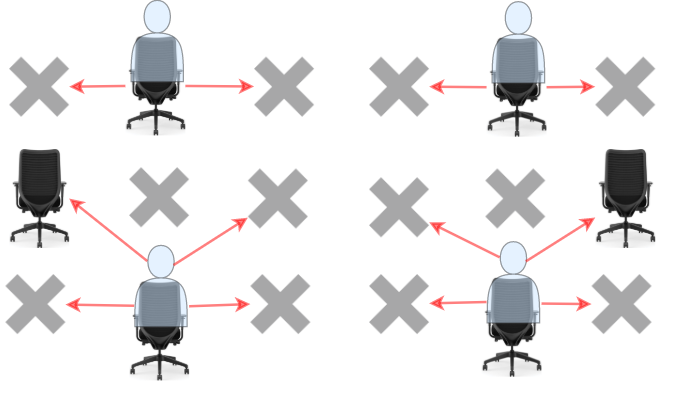

[#1349-maximum-students-taking-exam]
= 1349. 参加考试的最大学生数

https://leetcode.cn/problems/maximum-students-taking-exam/[LeetCode - 1349. 参加考试的最大学生数^]

给你一个 `m * n` 的矩阵 `seats` 表示教室中的座位分布。如果座位是坏的（不可用），就用 `#` 表示；否则，用 `.` 表示。

学生可以看到左侧、右侧、左上、右上这四个方向上紧邻他的学生的答卷，但是看不到直接坐在他前面或者后面的学生的答卷。请你计算并返回该考场可以容纳的同时参加考试且无法作弊的 **最大** 学生人数。

学生必须坐在状况良好的座位上。

*示例 1：*

....
输入：seats = [["#",".","#","#",".","#"],
              [".","#","#","#","#","."],
              ["#",".","#","#",".","#"]]
输出：4
解释：教师可以让 4 个学生坐在可用的座位上，这样他们就无法在考试中作弊。
....

*示例 2：*

....
输入：seats = [[".","#"],
              ["#","#"],
              ["#","."],
              ["#","#"],
              [".","#"]]
输出：3
解释：让所有学生坐在可用的座位上。
....

*示例 3：*

....
输入：seats = [["#",".",".",".","#"],
              [".","#",".","#","."],
              [".",".","#",".","."],
              [".","#",".","#","."],
              ["#",".",".",".","#"]]
输出：10
解释：让学生坐在第 1、3 和 5 列的可用座位上。
....

*提示：*

* `seats` 只包含字符 `.` 和 `#`
* `m == seats.length`
* `n == seats[i].length`
* `+1 <= m <= 8+`
* `+1 <= n <= 8+`

== 思路分析

[[src-1349]]
[tabs]
====
一刷（回溯，超时）::
+
--
[{java_src_attr}]
----
include::{sourcedir}/_1349_MaximumStudentsTakingExam.java[tag=answer]
----
--

一刷::
+
--
[{java_src_attr}]
----
include::{sourcedir}/_1349_MaximumStudentsTakingExam_1.java[tag=answer]
----
--

二刷(暴力破解)::
+
--
[{java_src_attr}]
----
include::{sourcedir}/_1349_MaximumStudentsTakingExam_2a.java[tag=answer]
----
--

二刷(备忘录)::
+
--
[{java_src_attr}]
----
include::{sourcedir}/_1349_MaximumStudentsTakingExam_2b.java[tag=answer]
----
--
====

== 参考资料

. https://leetcode.cn/problems/maximum-students-taking-exam/solutions/2580043/jiao-ni-yi-bu-bu-si-kao-dong-tai-gui-hua-9y5k/[1349. 参加考试的最大学生数 - 教你一步步思考动态规划：从记忆化搜索到递推^]
. https://leetcode.cn/problems/maximum-students-taking-exam/solutions/101748/can-jia-kao-shi-de-zui-da-xue-sheng-shu-by-leetcod/[1349. 参加考试的最大学生数 - 官方题解^]
