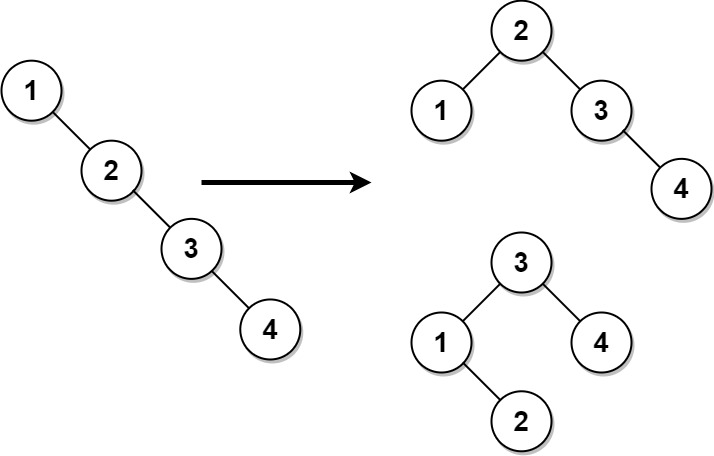

[#1382-balance-a-binary-search-tree]
= 1382. 将二叉搜索树变平衡

https://leetcode.cn/problems/balance-a-binary-search-tree/[LeetCode - 1382. 将二叉搜索树变平衡 ^]

给你一棵二叉搜索树，请你返回一棵 *平衡后* 的二叉搜索树，新生成的树应该与原来的树有着相同的节点值。如果有多种构造方法，请你返回任意一种。

如果一棵二叉搜索树中，每个节点的两棵子树高度差不超过 `1`，我们就称这棵二叉搜索树是 *平衡的* 。

*示例 1：*

....
输入：root = [1,null,2,null,3,null,4,null,null]
输出：[2,1,3,null,null,null,4]
解释：这不是唯一的正确答案，[3,1,4,null,2,null,null] 也是一个可行的构造方案。
....

*示例 2：*

image::images/1382-02.jpg[{image_attr}]

....
输入: root = [2,1,3]
输出: [2,1,3]
....

*提示：*

* 树节点的数目在 `[1, 10^4^]` 范围内。
* `1 \<= Node.val \<= 10^5^`

== 思路分析

二叉搜索树，先中序遍历拿到所有节点，然后递归构造平衡二叉搜索树。

[[src-1382]]
[tabs]
====
一刷::
+
--
[{java_src_attr}]
----
include::{sourcedir}/_1382_BalanceABinarySearchTree.java[tag=answer]
----
--

// 二刷::
// +
// --
// [{java_src_attr}]
// ----
// include::{sourcedir}/_1382_BalanceABinarySearchTree_2.java[tag=answer]
// ----
// --
====

== 参考资料

. https://leetcode.cn/problems/balance-a-binary-search-tree/solutions/150820/shou-si-avlshu-wo-bu-guan-wo-jiu-shi-yao-xuan-zhua/[1382. 将二叉搜索树变平衡 - 手撕AVL树，我不管，我就是要旋转^]
. https://leetcode.cn/problems/balance-a-binary-search-tree/solutions/457827/1382-jiang-er-cha-sou-suo-shu-bian-ping-heng-gou-z/[1382. 将二叉搜索树变平衡 - 「代码随想录」1382. 将二叉搜索树变平衡:【构造平衡二叉搜索树】详解^]
. https://leetcode.cn/problems/balance-a-binary-search-tree/solutions/241897/jiang-er-cha-sou-suo-shu-bian-ping-heng-by-leetcod/[1382. 将二叉搜索树变平衡 - 官方题解^]
