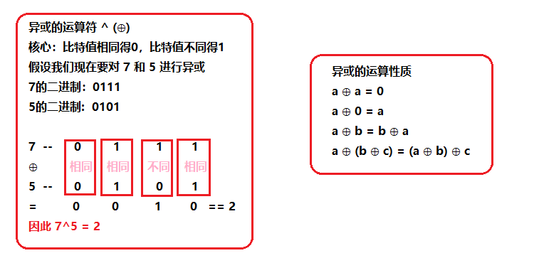

[#1442-count-triplets-that-can-form-two-arrays-of-equal-xor]
= 1442. 形成两个异或相等数组的三元组数目

https://leetcode.cn/problems/count-triplets-that-can-form-two-arrays-of-equal-xor/[LeetCode - 1442. 形成两个异或相等数组的三元组数目 ^]

给你一个整数数组 `arr` 。

现需要从数组中取三个下标 `i`、`j` 和 `k` ，其中 `+(0 <= i < j <= k < arr.length)+` 。

`a` 和 `b` 定义如下：

* `a = arr[i] ^ arr[i + 1] ^ ... ^ arr[j - 1]`
* `b = arr[j] ^ arr[j + 1] ^ ... ^ arr[k]`

注意：*^* 表示 *按位异或* 操作。

请返回能够令 `a == b` 成立的三元组 (`i`, `j` , `k`) 的数目。

*示例 1：*

....
输入：arr = [2,3,1,6,7]
输出：4
解释：满足题意的三元组分别是 (0,1,2), (0,2,2), (2,3,4) 以及 (2,4,4)
....

*示例 2：*

....
输入：arr = [1,1,1,1,1]
输出：10
....

*示例 3：*

....
输入：arr = [2,3]
输出：0
....

*示例 4：*

....
输入：arr = [1,3,5,7,9]
输出：3
....

*示例 5：*

....
输入：arr = [7,11,12,9,5,2,7,17,22]
输出：8
....

*提示：*

* `+1 <= arr.length <= 300+`
* `1 \<= arr[i] \<= 10^8^`

== 思路分析

回溯，通过 46 / 47 测试用例。使用回溯应该对，但是加上备忘录后，还是有一个测试用例没通过。（看一个题解，原始解法就是暴力法。是对的。）

使用官方题解中的异或前缀和解法啦。数学知识还是得补啊！

[[src-1442]]
[tabs]
====
一刷::
+
--
[{java_src_attr}]
----
include::{sourcedir}/_1442_CountTripletsThatCanFormTwoArraysOfEqualXor.java[tag=answer]
----
--

// 二刷::
// +
// --
// [{java_src_attr}]
// ----
// include::{sourcedir}/_1442_CountTripletsThatCanFormTwoArraysOfEqualXor_2.java[tag=answer]
// ----
// --
====

== 参考资料

. https://leetcode.cn/problems/count-triplets-that-can-form-two-arrays-of-equal-xor/solutions/579281/xing-cheng-liang-ge-yi-huo-xiang-deng-sh-jud0/[1442. 形成两个异或相等数组的三元组数目 - 官方题解^]
. https://leetcode.cn/problems/count-triplets-that-can-form-two-arrays-of-equal-xor/solutions/782444/xin-shou-pian-qian-ru-shen-chu-xi-lie-1-cnk37/[1442. 形成两个异或相等数组的三元组数目 - 新手篇 -- 浅入深出系列1^] -- 看这个题解，我的回溯就是这里的暴力法，那应该是对的。
