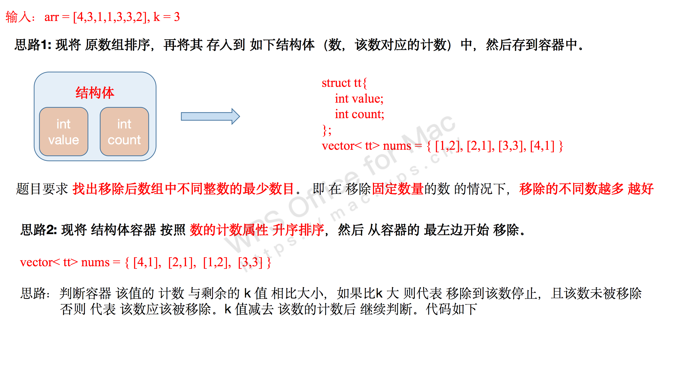

[#1481-least-number-of-unique-integers-after-k-removals]
= 1481. 不同整数的最少数目

https://leetcode.cn/problems/least-number-of-unique-integers-after-k-removals/[LeetCode - 1481. 不同整数的最少数目^]

给你一个整数数组 `arr` 和一个整数 `k`。现需要从数组中恰好移除 `k` 个元素，请找出移除后数组中不同整数的最少数目。

*示例 1：*

....
输入：arr = [5,5,4], k = 1
输出：1
解释：移除 1 个 4 ，数组中只剩下 5 一种整数。
....

*示例 2：*

....
输入：arr = [4,3,1,1,3,3,2], k = 3
输出：2
解释：先移除 4、2 ，然后再移除两个 1 中的任意 1 个或者三个 3 中的任意 1 个，最后剩下 1 和 3 两种整数。
....

*提示：*

* `1 \<= arr.length \<= 10^5`
* `1 \<= arr[i] \<= 10^9`
* `0 \<= k \<= arr.length`

== 思路分析

先统计每个数字出现的次数，再根据出现次数，升序排列，从前向后删除数字即可。

可以用优先队列，也可以排序。

[[src-1481]]
[tabs]
====
一刷::
+
--
[{java_src_attr}]
----
include::{sourcedir}/_1481_LeastNumberOfUniqueIntegersAfterKRemovals.java[tag=answer]
----
--

// 二刷::
// +
// --
// [{java_src_attr}]
// ----
// include::{sourcedir}/_1481_LeastNumberOfUniqueIntegersAfterKRemovals_2.java[tag=answer]
// ----
// --
====

== 参考资料

. https://leetcode.cn/problems/least-number-of-unique-integers-after-k-removals/solutions/1592995/zui-jian-dan-de-pai-xu-jie-gou-ti-by-p-o-xcds/[1481. 不同整数的最少数目 - 最简单的 排序 + 结构体^]
. https://leetcode.cn/problems/least-number-of-unique-integers-after-k-removals/solutions/579291/bu-tong-zheng-shu-de-zui-shao-shu-mu-by-h6h4i/[1481. 不同整数的最少数目 - 官方题解^]
