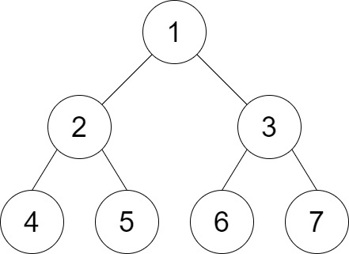

[#1530-number-of-good-leaf-nodes-pairs]
= 1530. 好叶子节点对的数量

https://leetcode.cn/problems/number-of-good-leaf-nodes-pairs/[LeetCode - 1530. 好叶子节点对的数量 ^]

给你二叉树的根节点 `root` 和一个整数 `distance` 。

如果二叉树中两个 *叶* 节点之间的 *最短路径长度* 小于或者等于 `distance` ，那它们就可以构成一组 *好叶子节点对* 。

返回树中 *好叶子节点对的数量* 。

*示例 1：*

image::images/1530-01.jpg[{image_attr}]

....
输入：root = [1,2,3,null,4], distance = 3
输出：1
解释：树的叶节点是 3 和 4 ，它们之间的最短路径的长度是 3 。这是唯一的好叶子节点对。
....

*示例 2：*

....
输入：root = [1,2,3,4,5,6,7], distance = 3
输出：2
解释：好叶子节点对为 [4,5] 和 [6,7] ，最短路径长度都是 2 。但是叶子节点对 [4,6] 不满足要求，因为它们之间的最短路径长度为 4 。
....

*示例 3：*

....
输入：root = [7,1,4,6,null,5,3,null,null,null,null,null,2], distance = 3
输出：1
解释：唯一的好叶子节点对是 [2,5] 。
....

*示例 4：*

....
输入：root = [100], distance = 1
输出：0
....

*示例 5：*

....
输入：root = [1,1,1], distance = 2
输出：1
....

*提示：*

* `tree` 的节点数在 `[1, 2^10^]` 范围内。
* 每个节点的值都在 `[1, 100]` 之间。
* `+1 <= distance <= 10+`

== 思路分析

深度优先遍历

[[src-1530]]
[tabs]
====
一刷::
+
--
[{java_src_attr}]
----
include::{sourcedir}/_1530_NumberOfGoodLeafNodesPairs.java[tag=answer]
----
--

// 二刷::
// +
// --
// [{java_src_attr}]
// ----
// include::{sourcedir}/_1530_NumberOfGoodLeafNodesPairs_2.java[tag=answer]
// ----
// --
====

== 参考资料

