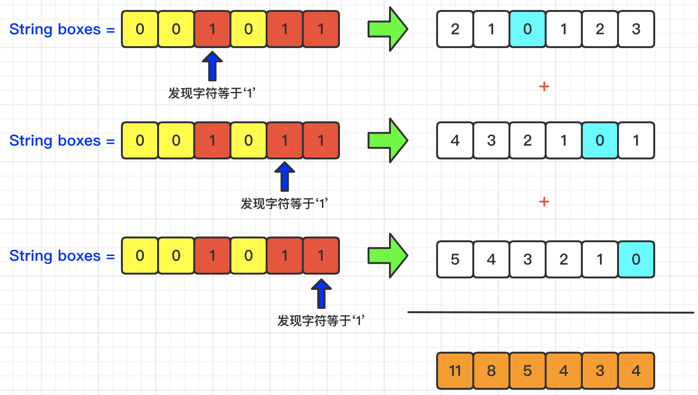
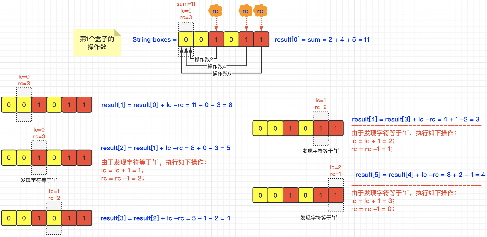

[#1769-minimum-number-of-operations-to-move-all-balls-to-each-box]
= 1769. 移动所有球到每个盒子所需的最小操作数

https://leetcode.cn/problems/minimum-number-of-operations-to-move-all-balls-to-each-box/[LeetCode - 1769. 移动所有球到每个盒子所需的最小操作数 ^]

有 `n` 个盒子。给你一个长度为 `n` 的二进制字符串 `boxes` ，其中 `boxes[i]` 的值为 `'0'` 表示第 `i` 个盒子是 *空* 的，而 `boxes[i]` 的值为 `'1'` 表示盒子里有 *一个* 小球。

在一步操作中，你可以将 *一个* 小球从某个盒子移动到一个与之相邻的盒子中。第 `i` 个盒子和第 `j` 个盒子相邻需满足 `abs(i - j) == 1`。注意，操作执行后，某些盒子中可能会存在不止一个小球。

返回一个长度为 `n` 的数组 `answer` ，其中 `answer[i]` 是将所有小球移动到第 `i` 个盒子所需的 *最小* 操作数。

每个 `answer[i]` 都需要根据盒子的 *初始状态* 进行计算。

*示例 1：*

....
输入：boxes = "110"
输出：[1,1,3]
解释：每个盒子对应的最小操作数如下：
1) 第 1 个盒子：将一个小球从第 2 个盒子移动到第 1 个盒子，需要 1 步操作。
2) 第 2 个盒子：将一个小球从第 1 个盒子移动到第 2 个盒子，需要 1 步操作。
3) 第 3 个盒子：将一个小球从第 1 个盒子移动到第 3 个盒子，需要 2 步操作。将一个小球从第 2 个盒子移动到第 3 个盒子，需要 1 步操作。共计 3 步操作。
....

*示例 2：*

....
输入：boxes = "001011"
输出：[11,8,5,4,3,4]
....

*提示：*

* `n == boxes.length`
* `+1 <= n <= 2000+`
* `boxes[i]` 为 `'0'` 或 `'1'`

== 思路分析

这道题可以理解成各个 `1` 到“本地”的距离之和。最容易想到的方案是，两重循环，计算当前节点到各个 `1` 的距离之和。

更取巧的解法是利用前缀和的原理，先从左到右，统计左侧有多少个 `1`, 从左侧到当前节点，则需要从左侧的操作次数再加上左侧节点的数量，这不就是“前缀和”吗？然后，分别计算左右两侧到当前节点的距离。最后，两组距离分别分别对应相加，则可以计算书最后结果。

[[src-1769]]
[tabs]
====
一刷::
+
--
[{java_src_attr}]
----
include::{sourcedir}/_1769_MinimumNumberOfOperationsToMoveAllBallsToEachBox.java[tag=answer]
----
--

一刷（优化）::
+
--
[{java_src_attr}]
----
include::{sourcedir}/_1769_MinimumNumberOfOperationsToMoveAllBallsToEachBox_1.java[tag=answer]
----
--

// 二刷::
// +
// --
// [{java_src_attr}]
// ----
// include::{sourcedir}/_1769_MinimumNumberOfOperationsToMoveAllBallsToEachBox_2.java[tag=answer]
// ----
// --
====

== 参考资料

. https://leetcode.cn/problems/minimum-number-of-operations-to-move-all-balls-to-each-box/solutions/2000188/yi-dong-suo-you-qiu-dao-mei-ge-he-zi-suo-y50e/[1769. 移动所有球到每个盒子所需的最小操作数 - 官方题解^]
. https://leetcode.cn/problems/minimum-number-of-operations-to-move-all-balls-to-each-box/solutions/2001791/-by-muse-77-ilaz/[1769. 移动所有球到每个盒子所需的最小操作数 - 【爪哇缪斯】图解LeetCode^]
