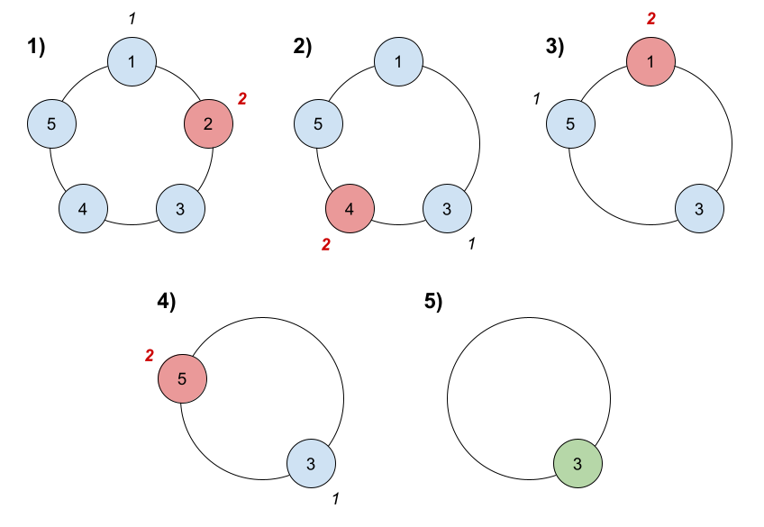
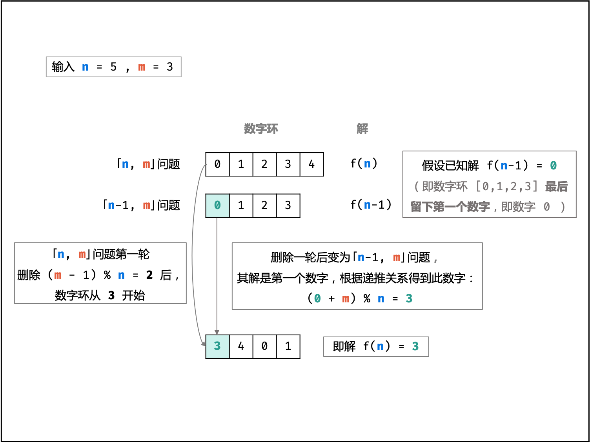

[#1823-find-the-winner-of-the-circular-game]
= 1823. Find the Winner of the Circular Game

{leetcode}/problems/find-the-winner-of-the-circular-game/[LeetCode - 1823. Find the Winner of the Circular Game ^]

There are `n` friends that are playing a game. The friends are sitting in a circle and are numbered from `1` to `n` in *clockwise order*. More formally, moving clockwise from the `i^th^` friend brings you to the `(i+1)^th^` friend for `1 <= i < n`, and moving clockwise from the `n^th^` friend brings you to the `1^st^` friend.

The rules of the game are as follows:

* *Start* at the `1^st^` friend.
* Count the next `k` friends in the clockwise direction *including* the friend you started at. The counting wraps around the circle and may count some friends more than once.
* The last friend you counted leaves the circle and loses the game.
* If there is still more than one friend in the circle, go back to step `2` *starting* from the friend *immediately clockwise* of the friend who just lost and repeat.
* Else, the last friend in the circle wins the game.

Given the number of friends, `n`, and an integer `k`, return _the winner of the game_.

 
*Example 1:*

[subs="verbatim,quotes"]
----
*Input:* n = 5, k = 2
*Output:* 3
*Explanation:* Here are the steps of the game:
1) Start at friend 1.
2) Count 2 friends clockwise, which are friends 1 and 2.
3) Friend 2 leaves the circle. Next start is friend 3.
4) Count 2 friends clockwise, which are friends 3 and 4.
5) Friend 4 leaves the circle. Next start is friend 5.
6) Count 2 friends clockwise, which are friends 5 and 1.
7) Friend 1 leaves the circle. Next start is friend 3.
8) Count 2 friends clockwise, which are friends 3 and 5.
9) Friend 5 leaves the circle. Only friend 3 is left, so they are the winner.
----

*Example 2:*

[subs="verbatim,quotes"]
----
*Input:* n = 6, k = 5
*Output:* 1
*Explanation:* The friends leave in this order: 5, 4, 6, 2, 3. The winner is friend 1.

----

 
*Constraints:*

* `1 \<= k \<= n \<= 500`

 
*Follow up:*

Could you solve this problem in linear time with constant space?

== 思路分析

[[src-1823]]
[tabs]
====
一刷::
+
--
[{java_src_attr}]
----
include::{sourcedir}/_1823_FindTheWinnerOfTheCircularGame.java[tag=answer]
----
--

// 二刷::
// +
// --
// [{java_src_attr}]
// ----
// include::{sourcedir}/_1823_FindTheWinnerOfTheCircularGame_2.java[tag=answer]
// ----
// --
====

== 参考资料

. https://leetcode.cn/problems/find-the-winner-of-the-circular-game/solutions/1463524/zhao-chu-you-xi-de-huo-sheng-zhe-by-leet-w2jd/?envType=study-plan-v2&envId=selected-coding-interview[1823. 找出游戏的获胜者 - 官方题解^]
. https://leetcode.cn/problems/find-the-winner-of-the-circular-game/solutions/2362052/1823-zhao-chu-you-xi-de-huo-sheng-zhe-yu-tkst/?envType=study-plan-v2&envId=selected-coding-interview[1823. 找出游戏的获胜者 - 约瑟夫环，清晰图解^]

