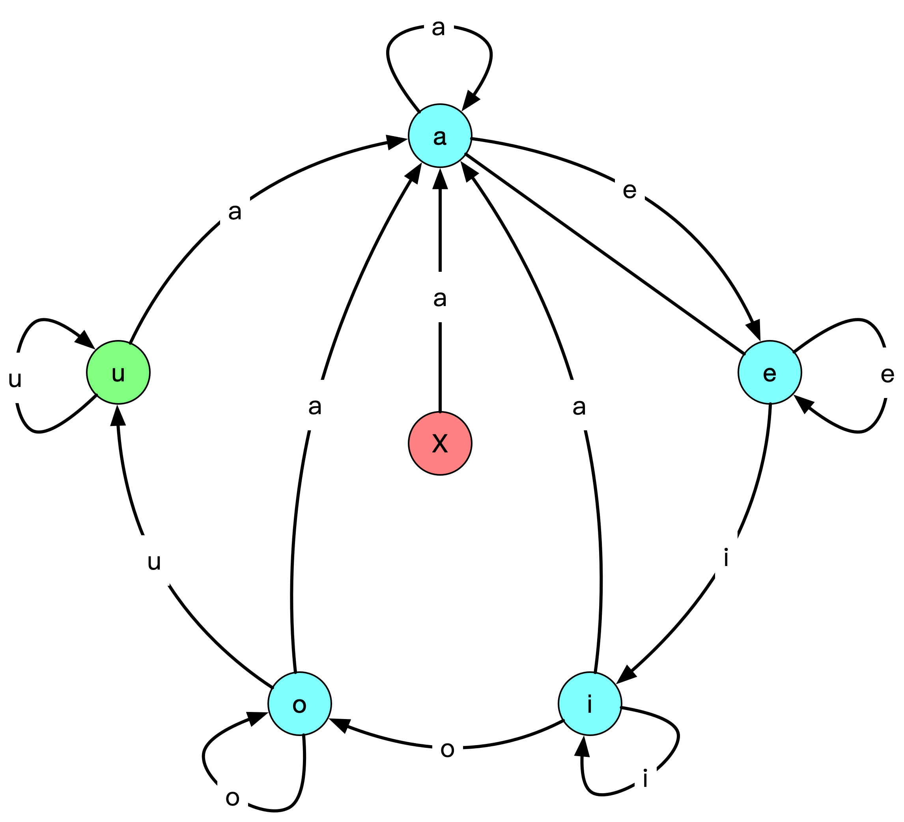

[#1839-longest-substring-of-all-vowels-in-order]
= 1839. 所有元音按顺序排布的最长子字符串

https://leetcode.cn/problems/longest-substring-of-all-vowels-in-order/[LeetCode - 1839. 所有元音按顺序排布的最长子字符串 ^]

当一个字符串满足如下条件时，我们称它是 *美丽的* ：

* 所有 5 个英文元音字母（`a` ，`e` ，`i` ，`o` ，`u`）都必须 *至少* 出现一次。
* 这些元音字母的顺序都必须按照 *字典序* 升序排布（也就是说所有的 `a` 都在 `e` 前面，所有的 `e` 都在 `i` 前面，以此类推）

比方说，字符串 `aeiou` 和 `aaaaaaeiiiioou` 都是 *美丽的* ，但是 `uaeio` ，`aeoiu` 和 `aaaeeeooo` *不是美丽的* 。

给你一个只包含英文元音字母的字符串 `word` ，请你返回 `word` 中 *最长美丽子字符串的长度* 。如果不存在这样的子字符串，请返回 `0` 。

*子字符串* 是字符串中一个连续的字符序列。

*示例 1：*

....
输入：word = "aeiaaioaaaaeiiiiouuuooaauuaeiu"
输出：13
解释：最长子字符串是 "aaaaeiiiiouuu" ，长度为 13 。
....

*示例 2：*

....
输入：word = "aeeeiiiioooauuuaeiou"
输出：5
解释：最长子字符串是 "aeiou" ，长度为 5 。
....

*示例 3：*

....
输入：word = "a"
输出：0
解释：没有美丽子字符串，所以返回 0 。
....

*提示：*

* `1 \<= word.length \<= 5 * 10^5^`
* `word` 只包含字符 `a`，`e`，`i`，`o` 和 `u` 。

== 思路分析

其实就是一个字符判断，当遇到第一个 `a` 时开始计数，符合要求（和上一个字符相同，或者是下一个元音字符）计数加一，否则归零。当到达最后一个元音字符时，开始更新结果值，保留最大值。

TIP: 看题解，可以只比较字符大小来解答，探索一下解法。

[[src-1839]]
[tabs]
====
一刷::
+
--
[{java_src_attr}]
----
include::{sourcedir}/_1839_LongestSubstringOfAllVowelsInOrder.java[tag=answer]
----
--

// 二刷::
// +
// --
// [{java_src_attr}]
// ----
// include::{sourcedir}/_1839_LongestSubstringOfAllVowelsInOrder_2.java[tag=answer]
// ----
// --
====

== 参考资料

. https://leetcode.cn/problems/longest-substring-of-all-vowels-in-order/solutions/742722/suo-you-yuan-yin-an-shun-xu-pai-bu-de-zu-9wqg/[1839. 所有元音按顺序排布的最长子字符串 - 官方题解^]
. https://leetcode.cn/problems/longest-substring-of-all-vowels-in-order/solutions/742704/bi-da-xiao-by-sweetpepperj-gdlt/[1839. 所有元音按顺序排布的最长子字符串 - 不用元音判断，直接通过比大小解题^] -- 这个解法非常轻巧！
. https://leetcode.cn/problems/longest-substring-of-all-vowels-in-order/solutions/3674813/tan-xin-hua-dong-chuang-kou-c-by-lukasir-l7la/[1839. 所有元音按顺序排布的最长子字符串 - 贪心+滑动窗口(C++)^]
