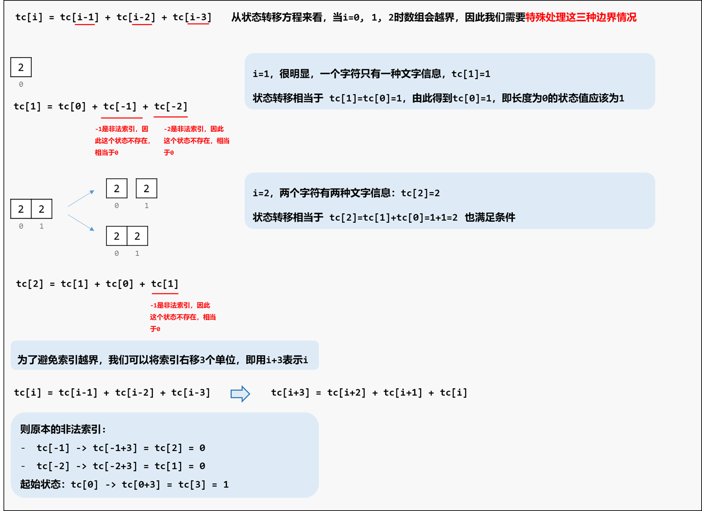
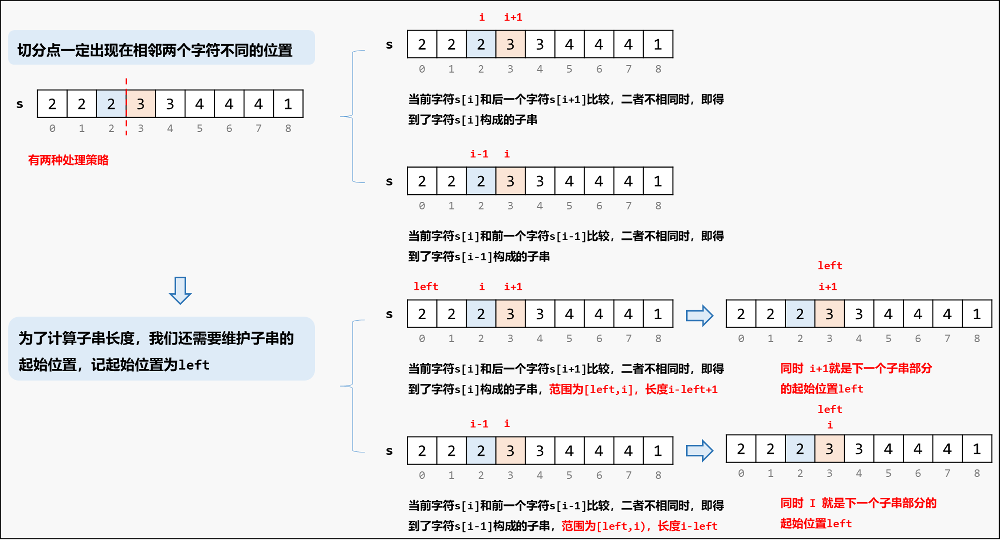

[#2266-count-number-of-texts]
= 2266. 统计打字方案数

https://leetcode.cn/problems/count-number-of-texts/[LeetCode - 2266. 统计打字方案数^]

Alice 在给 Bob 用手机打字。数字到字母的 *对应* 如下图所示。

image::images/0017-01.svg[{image_attr}]

为了 *打出* 一个字母，Alice 需要 *按* 对应字母 `i` 次，`i` 是该字母在这个按键上所处的位置。

* 比方说，为了按出字母 `s` ，Alice 需要按 `7` 四次。类似的，Alice 需要按 `5` 两次得到字母  `k`。
* 注意，数字 `0` 和 `1` 不映射到任何字母，所以 Alice *不* 使用它们。

但是，由于传输的错误，Bob 没有收到 Alice 打字的字母信息，反而收到了 *按键的字符串信息*。

* 比方说，Alice 发出的信息为 `bob` ，Bob 将收到字符串 `2266622` 。

给你一个字符串 `pressedKeys` ，表示 Bob 收到的字符串，请你返回 Alice *总共可能发出多少种文字信息* 。

由于答案可能很大，将它对 `10^9^ + 7` *取余* 后返回。

*示例 1：*

....
输入：pressedKeys = "22233"
输出：8
解释：
Alice 可能发出的文字信息包括：
"aaadd", "abdd", "badd", "cdd", "aaae", "abe", "bae" 和 "ce" 。
由于总共有 8 种可能的信息，所以我们返回 8 。
....

*示例 2：*

....
输入：pressedKeys = "222222222222222222222222222222222222"
输出：82876089
解释：
总共有 2082876103 种 Alice 可能发出的文字信息。
由于我们需要将答案对 109 + 7 取余，所以我们返回 2082876103 % (109 + 7) = 82876089 。
....

*提示：*

* `1 \<= pressedKeys.length \<= 10^5^`
* `pressedKeys` 只包含数字 `2` 到 `9` 。

== 思路分析

将字符串按照相同字符进行切割，根据加法原理，每个子串内部是“爬楼梯”：每个按键上面有 `3` 或 `4` 个字母，那么按键列表，就可以有 `1~3` 或 `1~4` 个按键按出一个字母，这就是爬楼梯：stem:[$f(i) = f(i-1)+f(i-2)+f(i-3)$] 或 stem:[$f(i) = f(i-1)+f(i-2)+f(i-3)+f(i-4)$]；子串之间，根据乘法原理，直接相乘。

image::images/2266-10.png[{image_attr}]

image::images/2266-11.png[{image_attr}]

image::images/2266-14.png[{image_attr}]

[[src-2266]]
[tabs]
====
一刷(暴力破解)::
+
--
[{java_src_attr}]
----
include::{sourcedir}/_2266_CountNumberOfTexts_1a.java[tag=answer]
----
--

一刷(备忘录)::
+
--
[{java_src_attr}]
----
include::{sourcedir}/_2266_CountNumberOfTexts_1b.java[tag=answer]
----
--

一刷(优化备忘录)::
+
--
[{java_src_attr}]
----
include::{sourcedir}/_2266_CountNumberOfTexts_1c.java[tag=answer]
----
--

一刷(动态规划)::
+
--
[{java_src_attr}]
----
include::{sourcedir}/_2266_CountNumberOfTexts_1d.java[tag=answer]
----
--

// 二刷::
// +
// --
// [{java_src_attr}]
// ----
// include::{sourcedir}/_2266_CountNumberOfTexts_2.java[tag=answer]
// ----
// --
====

== 参考资料

. https://leetcode.cn/problems/count-number-of-texts/solutions/1477311/by-endlesscheng-gj8f/[2266. 统计打字方案数 - 分组 + 爬楼梯^]
. https://leetcode.cn/problems/count-number-of-texts/solutions/3051447/javapython3cshu-xue-dong-tai-gui-hua-ji-hylw6/[2266. 统计打字方案数 - 数学 + 动态规划：计算每一段连续同一字符的信息个数【图解】^]
. https://leetcode.cn/problems/count-number-of-texts/solutions/1478348/dao-ge-shua-ti-by-lcfgrn-z2cp/[2266. 统计打字方案数 - 动态规划分类讨论解题（2次优化，耗时优化到11ms）^]
. https://leetcode.cn/problems/count-number-of-texts/solutions/1538660/tong-ji-da-zi-fang-an-shu-by-leetcode-so-714a/[2266. 统计打字方案数 - 官方题解^]
.
