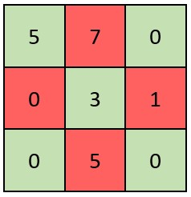

[#2319-check-if-matrix-is-x-matrix]
= 2319. 判断矩阵是否是一个 X 矩阵

https://leetcode.cn/problems/check-if-matrix-is-x-matrix/[LeetCode - 2319. 判断矩阵是否是一个 X 矩阵 ^]

如果一个正方形矩阵满足下述 *全部* 条件，则称之为一个 *X 矩阵* ：

. 矩阵对角线上的所有元素都 *不是 0*
. 矩阵中所有其他元素都是 *0*

给你一个大小为 `n x n` 的二维整数数组 `grid`，表示一个正方形矩阵。如果 __ `grid` __ 是一个 *X 矩阵* ，返回`true` ；否则，返回 `false` 。

*示例 1：*

image::images/2319-01.jpg[{image_attr}]

....
输入：grid = [[2,0,0,1],[0,3,1,0],[0,5,2,0],[4,0,0,2]]
输出：true
解释：矩阵如上图所示。
X 矩阵应该满足：绿色元素（对角线上）都不是 0 ，红色元素都是 0 。
因此，grid 是一个 X 矩阵。
....

*示例 2：*

....
输入：grid = [[5,7,0],[0,3,1],[0,5,0]]
输出：false
解释：矩阵如上图所示。
X 矩阵应该满足：绿色元素（对角线上）都不是 0 ，红色元素都是 0 。
因此，grid 不是一个 X 矩阵。
....

*提示：*

* `n == grid.length == grid[i].length`
* `+3 <= n <= 100+`
* `0 \<= grid[i][j] \<= 10^5^`

== 思路分析

遍历对角线设置成负值，检查其他元素，发现有大于 `0` 的则不成矩阵。

优化一下，在遍历对角线时，把同一行的数据也处理一下。这样可以复用一个循环。

主对角线上的下标需满足： stem:[i=j]。

反对角线上的下标需满足： stem:[i+j=n−1]。

[[src-2319]]
[tabs]
====
一刷::
+
--
[{java_src_attr}]
----
include::{sourcedir}/_2319_CheckIfMatrixIsXMatrix.java[tag=answer]
----
--

// 二刷::
// +
// --
// [{java_src_attr}]
// ----
// include::{sourcedir}/_2319_CheckIfMatrixIsXMatrix_2.java[tag=answer]
// ----
// --
====

== 参考资料

. https://leetcode.cn/problems/check-if-matrix-is-x-matrix/solutions/1625946/jian-ji-xie-fa-by-endlesscheng-ivjs/[2319. 判断矩阵是否是一个 X 矩阵 - 简洁写法^]
