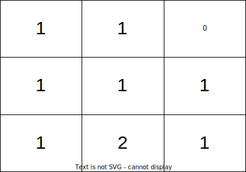
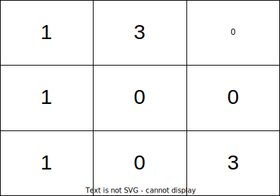

[#2850-minimum-moves-to-spread-stones-over-grid]
= 2850. 将石头分散到网格图的最少移动次数

https://leetcode.cn/problems/minimum-moves-to-spread-stones-over-grid/[LeetCode - 2850. 将石头分散到网格图的最少移动次数^]

给你一个大小为 `3 * 3` ，下标从 *0* 开始的二维整数矩阵 `grid` ，分别表示每一个格子里石头的数目。网格图中总共恰好有 `9` 个石头，一个格子里可能会有 *多个* 石头。

每一次操作中，你可以将一个石头从它当前所在格子移动到一个至少有一条公共边的相邻格子。

请你返回每个格子恰好有一个石头的 *最少移动次数* 。

*示例 1：*

....
输入：grid = [[1,1,0],[1,1,1],[1,2,1]]
输出：3
解释：让每个格子都有一个石头的一个操作序列为：
1 - 将一个石头从格子 (2,1) 移动到 (2,2) 。
2 - 将一个石头从格子 (2,2) 移动到 (1,2) 。
3 - 将一个石头从格子 (1,2) 移动到 (0,2) 。
总共需要 3 次操作让每个格子都有一个石头。
让每个格子都有一个石头的最少操作次数为 3 。
....

*示例 2：*

....
输入：grid = [[1,3,0],[1,0,0],[1,0,3]]
输出：4
解释：让每个格子都有一个石头的一个操作序列为：
1 - 将一个石头从格子 (0,1) 移动到 (0,2) 。
2 - 将一个石头从格子 (0,1) 移动到 (1,1) 。
3 - 将一个石头从格子 (2,2) 移动到 (1,2) 。
4 - 将一个石头从格子 (2,2) 移动到 (2,1) 。
总共需要 4 次操作让每个格子都有一个石头。
让每个格子都有一个石头的最少操作次数为 4 。
....

*提示：*

* `grid.length == grid[i].length == 3`
* `0 \<= grid[i][j] \<= 9`
* `grid` 中元素之和为 `9` 。

== 思路分析

回溯。找出所有的高峰和山谷，然后对高峰做排列，计算各种排列与山谷的距离，取最小值即可。有模糊思路，看答案才写出代码。

[[src-2850]]
[tabs]
====
一刷::
+
--
[{java_src_attr}]
----
include::{sourcedir}/_2850_MinimumMovesToSpreadStonesOverGrid.java[tag=answer]
----
--

二刷::
+
--
[{java_src_attr}]
----
include::{sourcedir}/_2850_MinimumMovesToSpreadStonesOverGrid_2.java[tag=answer]
----
--
====

== 参考资料

. https://leetcode.cn/problems/minimum-moves-to-spread-stones-over-grid/solutions/2435313/tong-yong-zuo-fa-zui-xiao-fei-yong-zui-d-iuw8/[2850. 将石头分散到网格图的最少移动次数 - 两种方法：枚举全排列 / 最小费用最大流^] -- 讲解比官方题解更易懂。
. https://leetcode.cn/problems/minimum-moves-to-spread-stones-over-grid/solutions/2850387/python3javacgotypescript-yi-ti-yi-jie-zh-tx29/[2850. 将石头分散到网格图的最少移动次数 - 一题一解：状态压缩动态规划（清晰题解）^] -- 这个解法很新颖！
. https://leetcode.cn/problems/minimum-moves-to-spread-stones-over-grid/solutions/2850899/yi-ti-san-jie-quan-pai-lie-hui-su-dfsyou-m4h8/[2850. 将石头分散到网格图的最少移动次数 - 【一题三解】全排列 + DFS回溯 + 优化，说明贪心假^]

