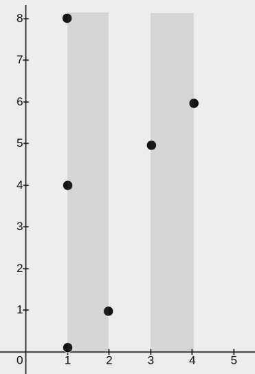
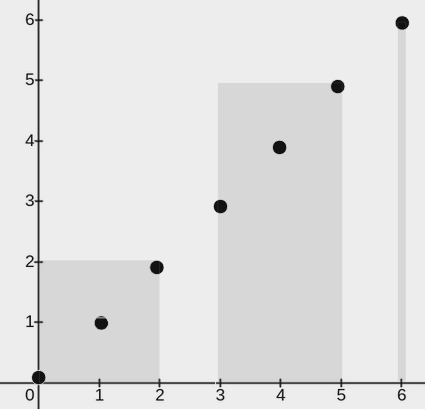
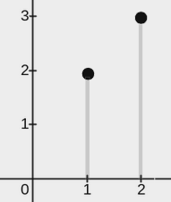

[#3111-minimum-rectangles-to-cover-points]
= 3111. 覆盖所有点的最少矩形数目

https://leetcode.cn/problems/minimum-rectangles-to-cover-points/[LeetCode - 3111. 覆盖所有点的最少矩形数目 ^]

给你一个二维整数数组 `point` ，其中 `points[i] = [x~i~, y~i~]` 表示二维平面内的一个点。同时给你一个整数 `w` 。你需要用矩形 *覆盖所有* 点。

每个矩形的左下角在某个点 `(x~1~, 0)` 处，且右上角在某个点 `(x~2~, y~2~)` 处，其中 `x~1~ \<= x~2~` 且 `y~2~ >= 0` ，同时对于每个矩形都 *必须* 满足 `x~2~ - x~1~ \<= w` 。

如果一个点在矩形内或者在边上，我们说这个点被矩形覆盖了。

请你在确保每个点都 *至少* 被一个矩形覆盖的前提下，*最少* 需要多少个矩形。

**注意：**一个点可以被多个矩形覆盖。

*示例 1：*

*输入：* points = [[2,1],[1,0],[1,4],[1,8],[3,5],[4,6]], w = 1

*输出：* 2

*解释：*

上图展示了一种可行的矩形放置方案：

* 一个矩形的左下角在 `(1, 0)` ，右上角在 `(2, 8)` 。
* 一个矩形的左下角在 `(3, 0)` ，右上角在 `(4, 8)` 。

*示例 2：*

*输入：* points = [[0,0],[1,1],[2,2],[3,3],[4,4],[5,5],[6,6]], w = 2

*输出：* 3

*解释：*

上图展示了一种可行的矩形放置方案：

* 一个矩形的左下角在 `(0, 0)` ，右上角在 `(2, 2)` 。
* 一个矩形的左下角在 `(3, 0)` ，右上角在 `(5, 5)` 。
* 一个矩形的左下角在 `(6, 0)` ，右上角在 `(6, 6)` 。

*示例 3：*

*输入：* points = [[2,3],[1,2]], w = 0

*输出：* 2

*解释：*

上图展示了一种可行的矩形放置方案：

* 一个矩形的左下角在 `(1, 0)` ，右上角在 `(1, 2)` 。
* 一个矩形的左下角在 `(2, 0)` ，右上角在 `(2, 3)` 。

*提示：*

* `1 \<= points.length \<= 10^5^`
* `points[i].length == 2`
* `0 \<= x~i~ == points[i][0] \<= 10^9^`
* `0 \<= y~i~ == points[i][1] \<= 10^9^`
* `0 \<= w \<= 10^9^`
* 所有点坐标 `(x~i~, y~i~)` 互不相同。

== 思路分析

由于矩形的高没有限制，所以我们只需考虑点的横坐标。

矩形越宽，覆盖的点越多，所以 x~2~ 应该恰好等于 x~1~+w。

从左边界开始，尽可能多占用横轴。宽度耗尽，则从下一个点开始。

目前使用的办法是统计最小最大值，然后在区间内进行遍历。这样会空耗很多数字。另外一个办法是对输入按照 X 轴排序。这样就不需要空转很多数字。

[[src-3111]]
[tabs]
====
一刷::
+
--
[{java_src_attr}]
----
include::{sourcedir}/_3111_MinimumRectanglesToCoverPoints.java[tag=answer]
----
--

// 二刷::
// +
// --
// [{java_src_attr}]
// ----
// include::{sourcedir}/_3111_MinimumRectanglesToCoverPoints_2.java[tag=answer]
// ----
// --
====

== 参考资料

. https://leetcode.cn/problems/minimum-rectangles-to-cover-points/solutions/2857796/fu-gai-suo-you-dian-de-zui-shao-ju-xing-xduq9/[3111. 覆盖所有点的最少矩形数目 - 官方题解^]
. https://leetcode.cn/problems/minimum-rectangles-to-cover-points/solutions/2738903/tan-xin-jian-ji-xie-fa-pythonjavacgo-by-q377d/[3111. 覆盖所有点的最少矩形数目 - 贪心，简洁写法^]
